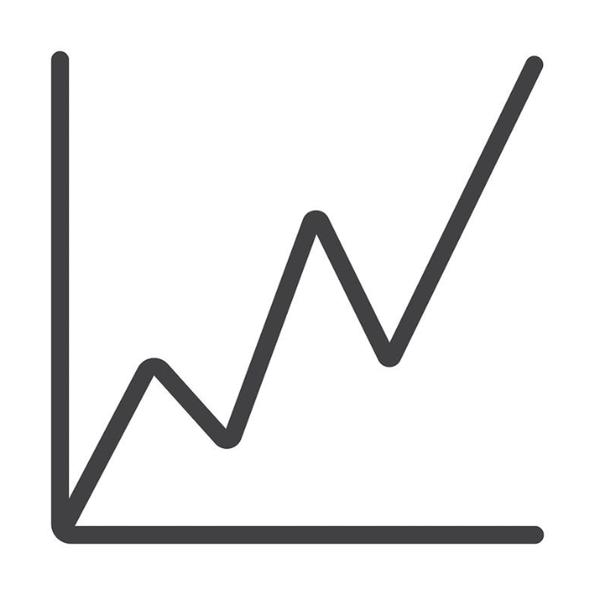

<p align="center">
  <a href="https://graph-lab-one.vercel.app/" target="_blank">
    
  </a>
</p>

<h1 align="center">GraphLab</h1>

<p align="center">
  <strong>Interactive Graph Theory Laboratory, Algorithm Visualizer & AI Tutor</strong>
</p>

<p align="center">
  <a href="https://graph-lab-one.vercel.app/">
    
  </a>
</p>

<p align="center">
  
  
  
  
  
</p>

---

> ### 🌐 **Live Application**: [https://graph-lab-one.vercel.app/](https://graph-lab-one.vercel.app/)
> Draw graphs, test theorems and invariants, solve two-graph isomorphisms, run step-by-step algorithms, and explore discrete math on any device (Desktop, Tablet, Mobile) — zero setup required!

---

## 📖 How to Use GraphLab

GraphLab is designed to be completely fluid and interactive. You can use mouse, trackpad, touch, or keyboard shortcuts:

### 1. Canvas Basics & Drawing
- **Add a Node**: Double-click anywhere on the canvas, or press `N`.
- **Connect an Edge**: Click and drag from one node to another, or select two nodes and press `E`.
- **Edit Edge Weights & Direction**: Click on any edge to customize its weight (`-999` to `999`) or toggle between **Directed** ($\to$) and **Undirected** ($\leftrightarrow$).
- **Marquee Selection (`B`)**: Click the Box Select tool or press `B`, then drag a rectangle to select multiple vertices. Drag the selection to move the group, or press `Backspace` / `Delete` to delete them in bulk.
- **Photoshop-Style Text Tool (`T`)**: Click the **Text Tool** in the toolbar or press `T`, then click anywhere on the canvas to write custom notes, annotations, theorem labels, or formulas. Click any existing text block to edit or drag to reposition it.
- **Generate Template Graphs**: Click **Generate** to spawn standard graphs (*Complete $K_n$, Cycle $C_n$, Bipartite $K_{m,n}$, Star, Tree, Grid*) neatly placed side-by-side on your canvas.

---

### 2. Graph Theory Invariants & Solvers
- **Two-Graph Isomorphism Check**:
  - Draw or generate two separate graphs on the canvas.
  - Click **Isomorphism** in the toolbar and hit **"Check Canvas Graphs"**.
  - GraphLab automatically segments the canvas components, verifies if $G_1 \cong G_2$, produces the exact vertex bijection mapping table ($f: V_1 \to V_2$), or flags non-isomorphic invariants (vertex counts, degree sequences, edge densities).
- **Havel-Hakimi Degree Sequences**:
  - Click **Sequence** to test if an arbitrary integer sequence (e.g. `[3, 3, 2, 2, 2]`) is graphical.
  - Watch the step-by-step reduction steps and click **Generate Graph Realization** to render it directly to canvas.
- **Complement Graphs ($\overline{G}$)**:
  - Click **Complement** to inspect the complement invariant $|E(G)| + |E(\overline{G})| = \binom{n}{2}$ and launch an interactive side-by-side comparison on the canvas.
- **Bipartite Verification & 2-Coloring**:
  - Click **Bipartite** to run a BFS 2-coloring test. If bipartite, click **"Rearrange in 2-Column Layout"**; if not, view the exact odd-cycle counterexample proof.
- **Subgraph Extraction**:
  - Click **Subgraph** to pick a subset of vertices and isolate their induced subgraph.

---

### 3. Step-by-Step Algorithm Visualizer
- **Supported Algorithms**: Breadth-First Search (BFS), Depth-First Search (DFS), Dijkstra's Shortest Path, Bellman-Ford (with negative cycle detection), Prim's Minimum Spanning Tree (MST), and Cycle Detection.
- **Execution Modes**:
  - **Auto Mode**: Runs continuously with adjustable playback speed (0.5x to 4x).
  - **Step Mode**: Step forward (`→`) and backward (`←`) step-by-step to inspect state transitions.
- **Live Data Structures**: Inspect algorithm internal state (Queue, Stack, Priority Queue, Distance Table, Parent Tree) in real-time as each step executes.

---

## 🔑 How to Get an API Key (Simple & Brief)

> 💡 **Note**: GraphLab includes a built-in offline mathematical heuristics engine that works immediately **without** any API key. An API key is only needed if you want live AI reasoning (Llama 3.3 70B, GPT-4o, or Gemini 2.0) in the AI Tutor.

You can use a free or personal API key from any of the following providers:

### 1. OpenRouter (Recommended — Free models available)
1. Go to [openrouter.ai/keys](https://openrouter.ai/keys) and log in.
2. Click **Create Key** and copy your key (starts with `sk-or-v1-...`).

### 2. Groq (Ultra-fast LPU inference)
1. Go to [console.groq.com/keys](https://console.groq.com/keys) and log in.
2. Click **Create API Key** and copy your key (starts with `gsk_...`).

### 3. OpenAI or Google Gemini
- **OpenAI**: [platform.openai.com/api-keys](https://platform.openai.com/api-keys) (starts with `sk-...`).
- **Google Gemini**: [aistudio.google.com/apikey](https://aistudio.google.com/apikey) (starts with `AIza...`).

---

### Where to Paste Your API Key

#### Option A: In the Browser UI (Fastest)
1. In the GraphLab toolbar, click the **AI Tutor** button.
2. At the bottom of the popup, click **"API Key"**.
3. Paste your key and click **"Save Key"**.
*(Your key is saved locally in your browser and automatically detects your provider!)*

#### Option B: In Environment Variables (`.env` or Vercel)
Set the following variable in your local `.env` file or in your **Vercel Project Settings → Environment Variables**:
```env
VITE_AI_API_KEY=your_key_here
```

---

## 📱 Responsive on All Screen Resolutions

GraphLab is engineered to provide a seamless experience across all device form factors:
- **Mobile Phones (<768px)**: Adaptive bottom controls bar, touch gestures, pan & zoom, full-width responsive popovers that fit within the viewport without horizontal scrolling.
- **Tablets & iPads (768px – 1024px)**: Streamlined icon toolbar, floating zoom & undo docked at bottom-left, responsive touch navigation.
- **Desktop (≥1024px)**: Full expanded tool suite, keyboard shortcuts, multi-renderer viewports (SVG, high-performance Canvas, and 3D WebGL).

---

## ⌨️ Keyboard Shortcuts

| Action | Windows / Linux | macOS |
|---|---|---|
| Select Mode | `V` | `V` |
| Add Node | `N` | `N` |
| Add Edge | `E` | `E` |
| Box / Marquee Select | `B` | `B` |
| Text Tool (Canvas Note) | `T` | `T` |
| Delete Selected | `Delete` / `Backspace` | `Backspace` |
| Undo | `Ctrl + Z` | `⌘ + Z` |
| Redo | `Ctrl + Y` or `Ctrl + Shift + Z` | `⌘ + Shift + Z` |
| Select All | `Ctrl + A` | `⌘ + A` |
| Fit to Screen | `Ctrl + 0` | `⌘ + 0` |
| Hold Pan | `Space` (Hold) | `Space` (Hold) |

---

## 🛠️ Local Development & Setup

### Prerequisites
- Node.js 18+ (Node.js 20+ recommended)
- `pnpm` (or `npm` / `yarn`)

### Installation & Run
```bash
# Clone the repository
git clone https://github.com/Nightkilller/GraphLab-.git
cd GraphLab-

# Install dependencies
pnpm install

# Start development server
pnpm dev
```
Open [http://localhost:3000](http://localhost:3000) in your browser.

### Build for Production
```bash
pnpm build
```
> **Note**: Production files are generated in the `build/` directory.

---

## 📄 License

This project is open-source under the [MIT License](LICENSE).
